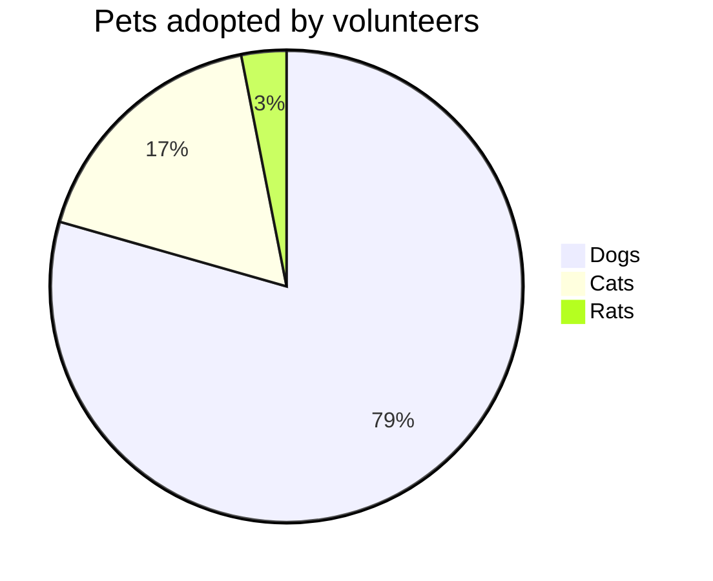
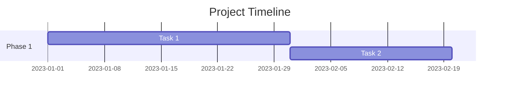

# Data Visualization (OpenClaw Adapted)

Create effective data visualizations to communicate insights clearly.

## When to Use
- Communicating data findings
- Choosing the right chart type
- Generating chart specifications (Mermaid, Vega-Lite, ASCII)
- Designing dashboards
- Presenting data stories

## Visualization Best Practices

### 1. Choosing the Right Chart

| Goal | Recommended Chart | Why? |
|------|-------------------|------|
| **Comparison** (Categories) | Bar Chart | Clear magnitude comparison |
| **Comparison** (Time) | Line Chart | Shows trends and seasonality |
| **Composition** (Parts of Whole) | Stacked Bar / Pie | Shows relative proportions |
| **Distribution** (Single Variable) | Histogram | Shows frequency and spread |
| **Distribution** (Multiple Variables) | Box Plot | Shows summary stats and outliers |
| **Relationship** (Two Variables) | Scatter Plot | Shows correlation and clusters |
| **Geospatial** | Choropleth Map | Shows regional patterns |

### 2. Design Principles

- **Simplicity:** Remove chart junk (unnecessary grids, borders, 3D effects).
- **Clarity:** Label axes, units, and legends clearly.
- **Focus:** Use color to highlight key data points, not just for decoration.
- **Context:** Include titles and annotations to explain the "so what."
- **Accessibility:** Use colorblind-friendly palettes and alt text.

## Visualization Formats

### 1. ASCII Charts (Text-Based)

Good for quick terminal output or simple reports.

**Bar Chart:**
```
Category A | ###### (6)
Category B | ########## (10)
Category C | #### (4)
```

**Sparkline:**
```
Trend:  ▂▃▅▆▇█ (Increasing)
```

### 2. Mermaid.js (Diagrams)

Good for flowcharts, gantt charts, and simple pie charts in markdown.

**Pie Chart:**


**Gantt Chart:**


### 3. Vega-Lite (JSON Specification)

Powerful declarative grammar for interactive charts.

```json
{
  "mark": "bar",
  "encoding": {
    "x": {"field": "category", "type": "nominal"},
    "y": {"field": "amount", "type": "quantitative"}
  }
}
```

## Visualization Workflow (OpenClaw)

1. **Analyze Data:** Understand variables and relationships using `data-exploration`.
2. **Select Chart Type:** Choose based on goal (Comparison, Distribution, etc.).
3. **Generate Spec:** Create ASCII, Mermaid, or Vega-Lite code.
4. **Render/Describe:** Output the visualization or description.
5. **Save:** Store specs in `/memory/data/visualizations/`.

## Dashboard Design

**Layout Principles:**
- **Top Left:** Key KPIs (Current performance)
- **Top Right:** High-level trends (Time series)
- **Middle:** Breakdown by category (Bar/Pie)
- **Bottom:** Detailed table or drill-down

**Interactivity:**
- Add filters (Time range, Category)
- Tooltips for details
- Linking between charts

## File Storage
`/memory/data/visualizations/[chart-name].[ext]`

---
*Adapted from knowledge-work-plugins (data/data-visualization) for OpenClaw*
