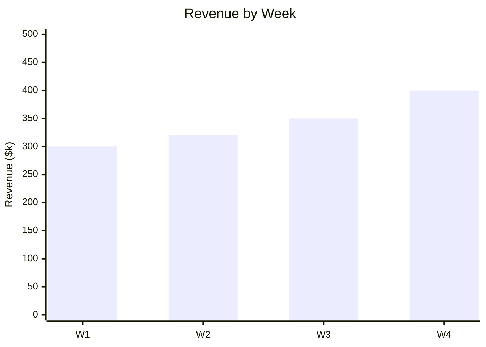
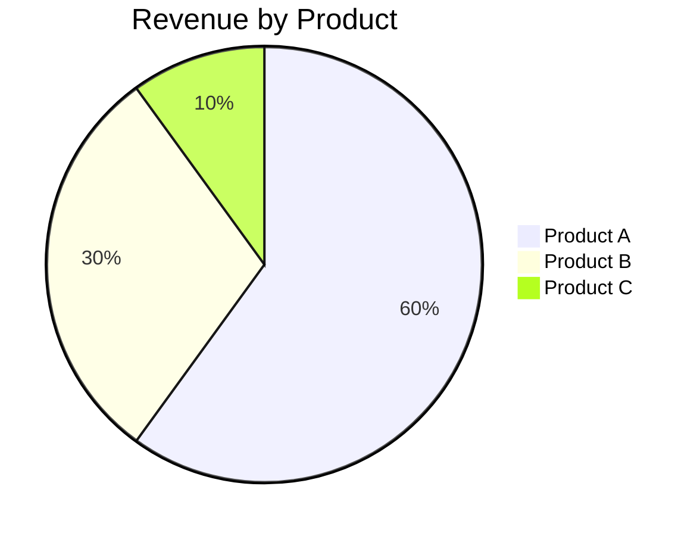

# Interactive Dashboard Builder (OpenClaw Adapted)

Design effective dashboards for monitoring and reporting.

## When to Use
- Designing dashboards
- Monitoring KPIs
- Visualizing trends
- Reporting performance
- Tracking progress

## Dashboard Design Framework

### 1. Define Purpose & Audience

- **Strategic:** High-level KPIs, long-term trends (Executives)
- **Operational:** Real-time metrics, alerts, drill-down (Managers/Analysts)
- **Analytical:** Complex data exploration, filtering (Analysts/Data Scientists)

### 2. Layout Principles (F-Pattern)

**Top Row (Key Metrics):**
- Current value
- Trend indicator (Up/Down)
- Comparison vs target/prior period

**Middle Section (Trends & breakdowns):**
- Time series charts (Line/Area)
- Category comparisons (Bar/Pie)
- Maps (if applicable)

**Bottom Section (Details):**
- Data tables with search/filter
- Detailed logs or lists

### 3. Key Metrics Selection

- **Lagging Indicators:** Historical performance (Revenue, churn)
- **Leading Indicators:** Predict future performance (Web traffic, pipeline value)
- **Ratios:** Efficiency measures (LTV/CAC, conversion rate)
- **Context:** Always compare to something (Target, Last Year, Last Month)

## Dashboard Templates (Markdown/HTML)

### Simple Markdown Dashboard

```markdown
# [Dashboard Title]
**Last Updated:** [YYYY-MM-DD HH:MM]

## Key Metrics

| Metric | Current | Trend | vs Target |
|--------|---------|-------|-----------|
| Revenue | $1.2M | ↗️ +5% | 🟢 On Track |
| Users | 45k | ↘️ -2% | 🔴 Off Track |
| NPS | 72 | ➡️ 0 | 🟡 At Risk |

## Trends (Last 30 Days)

**Revenue:**


**Users:**
[Describe trend: Steady growth, recent dip due to holiday]

## Breakdown by Category

**Revenue Share:**


## Action Items
- [ ] Investigate user drop-off in W3
- [ ] Review Product C marketing spend
```

### HTML Dashboard Structure (Conceptual)

```html
<div class="dashboard">
  <header>
    <h1>Sales Performance</h1>
    <div class="filters">Region: All | Period: Q1</div>
  </header>
  
  <div class="kpi-row">
    <div class="card kpi">Revenue: $1.2M</div>
    <div class="card kpi">Deals: 150</div>
    <div class="card kpi">Win Rate: 22%</div>
  </div>
  
  <div class="charts-row">
    <div class="card chart">Revenue Trend (Line)</div>
    <div class="card chart">Top Reps (Bar)</div>
  </div>
  
  <div class="table-row">
    <table>Detailed Deal List</table>
  </div>
</div>
```

## Using with OpenClaw

**Workflow:**
1. Define metrics and layout.
2. Gather data using SQL or `web_fetch`.
3. Create Markdown dashboard file.
4. Update periodically via `cron` or manual refresh.
5. Save to `/memory/dashboards/`.

## File Storage
`/memory/dashboards/[dashboard-name].md`

---
*Adapted from knowledge-work-plugins (data/interactive-dashboard-builder) for OpenClaw*
